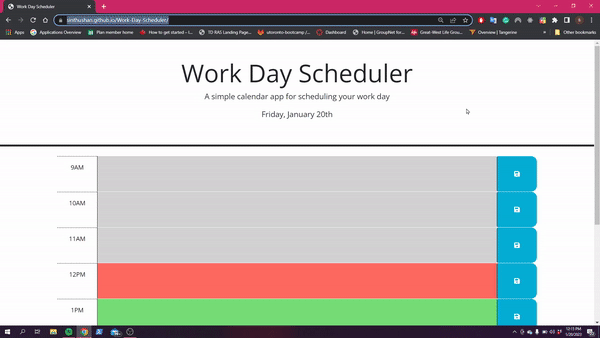

# Work-Day-Scheduler
## Description

This portfolio website will be an ongoing project to not only host coding projects that I have completed but to also use the knowledge gained from those projects to improve the portfolio website. The website currently uses simple HTML and CSS. The goal is to eventually add Vanilla Javascript and then move on to using a frontend framework.

## Table of Contents

- [Installation](#installation)
- [Usage](#usage)
- [License](#license)
- [Features](#Features)

## Installation

We are utilizing Bootstrap, Jquery and DayJS by linking to a CDN so no installations are needed. You can learn more by following the links below:
- [Bootstrap](https://getbootstrap.com/docs/3.4/getting-started/)
- [Jquery](https://jquery.com/download/)
- [DayJS](https://day.js.org/docs/en/installation/browser)

## Usage

To view the website you can either go to: [Work Day Scheduler](https://sinthushan.github.io/Work-Day-Scheduler/)

or

You can clone the repository using: `git clone git@github.com:sinthushan/Work-Day-Scheduler.git`
Once cloned open up the index.html file in a web browser to see the final product

### steps

* For each time slot the user can enter in a task or reminder
* Once tasked is written click the save button the the right
* All task will persist until manually cleared
* Time slots are all color coded so that grey means the time slots are in the past, red denoted the current time slot, and green are future slots

## License

MIT License

